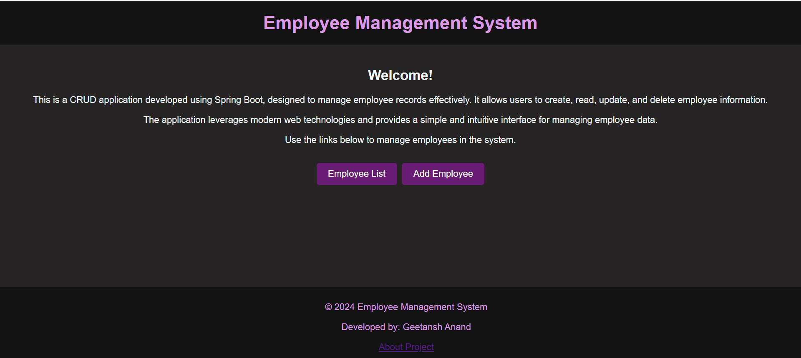
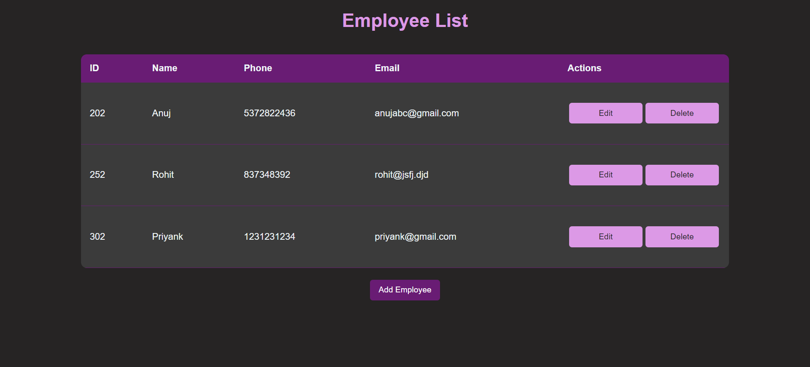
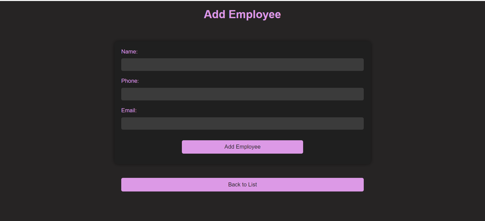
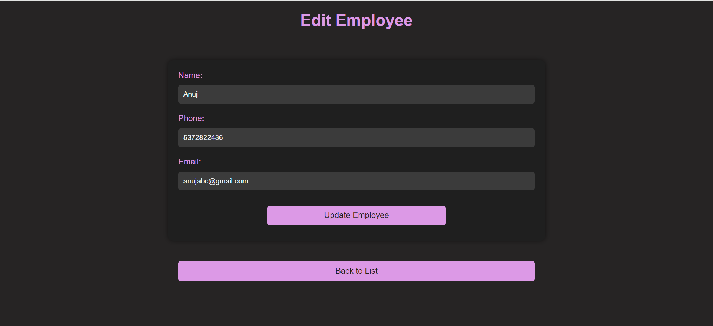

# Employee Management System

### Objective:
To design and implement an employee management system that allows users to manage employees with functionalities such as viewing, adding, editing, and deleting employee details. The project is developed using Java, Spring Boot, Thymeleaf, HTML, CSS, and MySQL for database interaction.

### Technologies Used:
- **Frontend**: HTML, CSS
- **Backend**: Java, Spring Boot, Thymeleaf
- **Database**: MySQL
- **Other**: JDBC (Java Database Connectivity), Maven for dependency management

### Project Components:

#### Welcome Page (index.html):
- A simple HTML page styled with CSS.
- Introduces the user to the system and provides navigation links to employee-related functionalities.
- Users can view employee lists, add, edit, or delete employees.

#### Employee List Page (employee_list.html):
- Displays a list of all employees with their details.
- Provides options to edit or delete employee records.
- Styled with CSS for a clean and user-friendly interface.

#### Add Employee Page (add_employee.html):
- A form that allows users to add a new employee to the system.
- Includes fields like employee name, email, phone number, and more.
- Data is validated on the frontend before submission.
- Form submission is handled by the `EmpController`.

#### Edit Employee Page (edit_employee.html):
- A form for editing an existing employee's details.
- The current employee data is fetched and displayed for the user to modify.
- Form submission is handled by the `EmpController`.

#### Spring Boot Application (EmprojectApplication.java):
- The main class for running the Spring Boot application.
- Uses the `@SpringBootApplication` annotation to auto-configure components.
- Serves as the entry point for the application.

#### Employee Controller (EmpController.java):
- Handles the business logic for employee-related operations.
- Defines endpoints for viewing, adding, updating, and deleting employees.
- Communicates with the service layer (`EmpService`) to interact with the database.

#### Service Layer (EmpService.java and EmpServiceImpl.java):
- Defines the core business logic for employee management.
- The `EmpService` interface defines the operations, and the `EmpServiceImpl` class provides their implementation.
- Communicates with the repository layer to perform CRUD operations.

#### DAO Layer (EmpRepository.java):
- Extends `JpaRepository` to interact with the MySQL database.
- Provides methods for saving, retrieving, updating, and deleting employee data from the database.

#### MySQL Database Setup:
- A MySQL database is used to store employee details.
- Tables such as `employees` store information like employee ID, name, email, and phone number.
- Database connection settings are configured in the `application.properties` file.

### Workflow:

#### Employee Management:
1. **Add Employee**: Users can add a new employee through the "Add Employee" page.
   - The `EmpController` processes the form submission and stores the new employee data in the MySQL database.
   
2. **Edit Employee**: Users can update employee information through the "Edit Employee" page.
   - The `EmpController` fetches the current data, allows modifications, and updates the record in the database.
   
3. **View Employee List**: The system displays all employees on the "Employee List" page, with options to edit or delete individual records.
   - Data is retrieved from the MySQL database via the `EmpRepository`.

4. **Delete Employee**: Users can remove an employee by clicking the "Delete" button next to the employee in the list.
   - The `EmpController` handles the deletion process by removing the employee from the database.

### Screenshots:

#### 1. Welcome Page

#### 2. Employee List Page

#### 3. Add Employee Page

#### 4. Edit Employee Page

### Database Schema:

- **Employees Table**:
  - `id` (INT): Primary key, auto-incremented.
  - `name` (VARCHAR): Employee name.
  - `email` (VARCHAR): Employee email.
  - `phone_number` (VARCHAR): Employee phone number.
  
### Conclusion:
This project demonstrates a comprehensive employee management system using Java, Spring Boot, and MySQL. It covers the essential CRUD operations for managing employee details, with clean separation of concerns between the controller, service, and repository layers.
